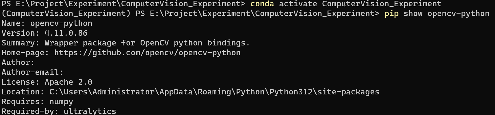

#  实验一：计算机视觉库的安装

## 一、实验目的

掌握 Anaconda 的安装与基本操作，熟悉 GPU 使用环境的配置及对应版本 PyTorch
的安装，并完成 OpenCV 的安装与配置

## 二、实验内容

### 1、Anaconda的安装及配置

###2、conda的基本操作与OpenCV的安装

1. **conda** **create -n[env_name] python==[version]**创建虚拟环境并制定python版本。 
2. **activate** **cv**进入创建的虚拟环境

###3、GPU加速环境配置

本机没有NVIDIA的显卡

### 4、PyTorch安装

 1.anaconda自带torch

### 5、PyTorch GPU加速环境验证

本机没有NVIDIA的显卡

##  三、实验总结

1. 此次实验较为基础，主要是后续CV实验搭建实验环境。 

2. 熟悉了Anaconda虚拟环境管理的基本操作。
3. 结合CUDA与cuDNN配置了GPU加速环境，为深层网络的高效训练奠定了基础。

