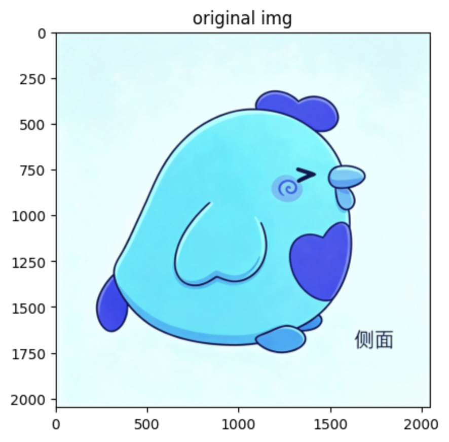
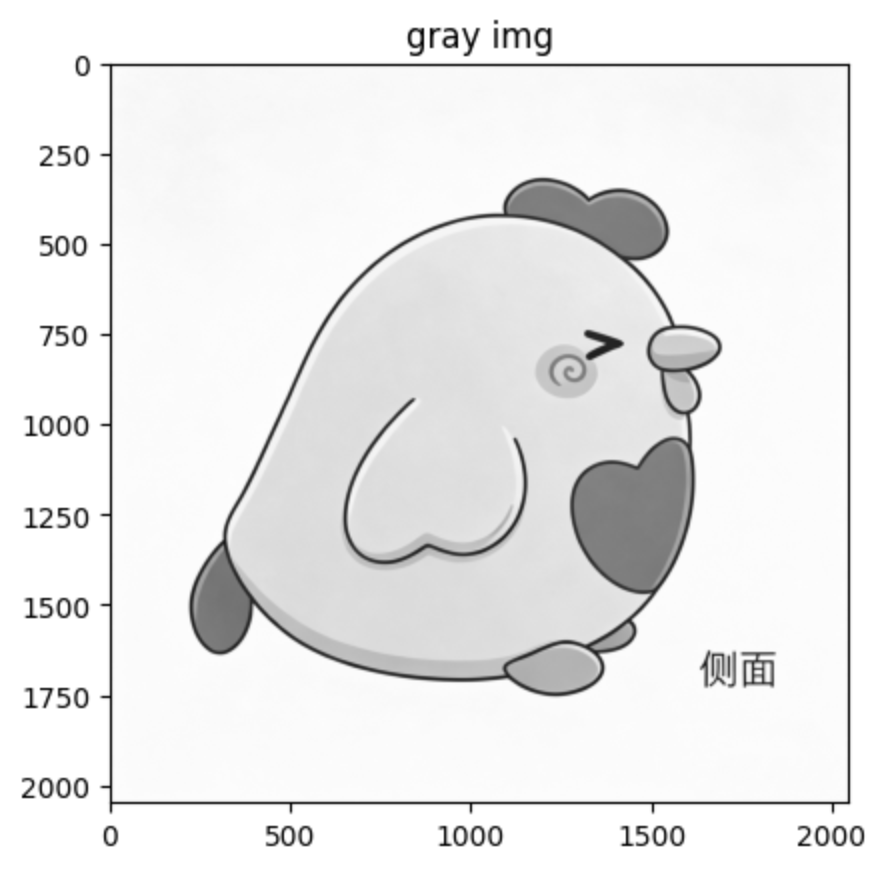
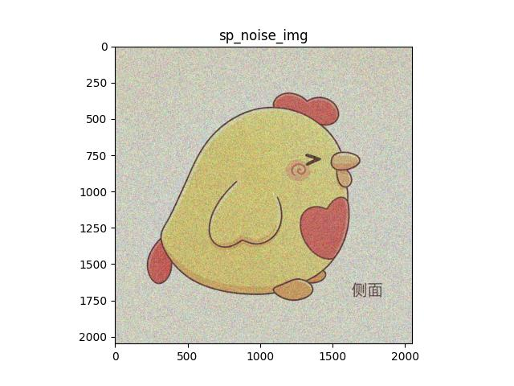
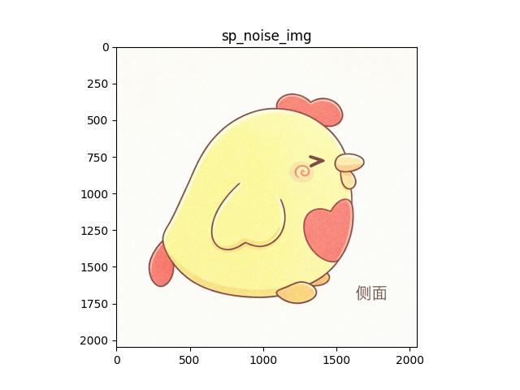
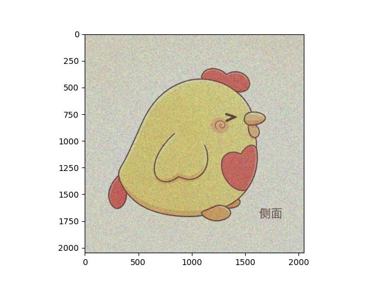
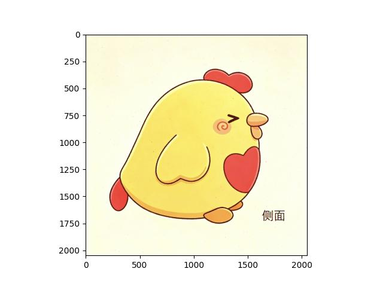
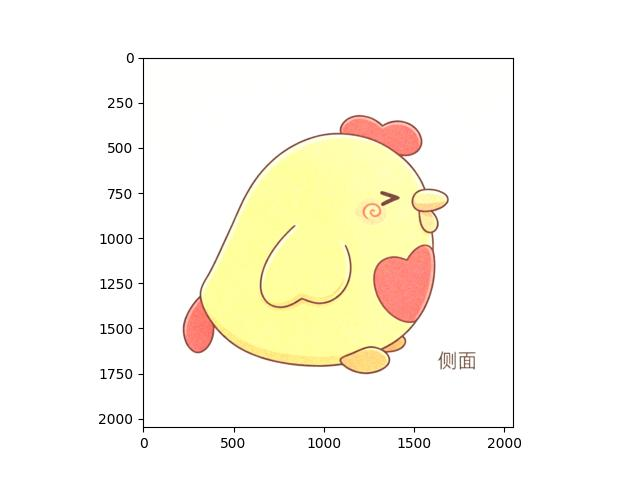
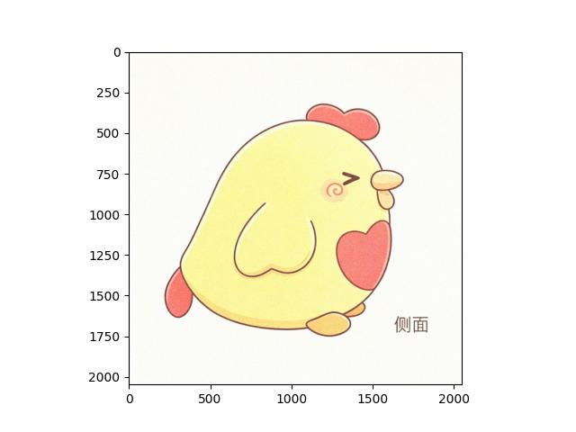

# 实验2 图像增强

##  ⼀、实验⽬的

学会OpenCV的基本使⽤⽅法，利⽤OpenCV等计算机库对图像进⾏平滑、滤
波等操作，实现图像增强。


## 二、实验内容

### 2.1 导⼊图像滤波相关的依赖包

* 1.OpenCV库：计算机视觉与图像处理
* 2.scikit-image库：图像增强与分析，random_noise ⽤于给
* 图像添加噪声
* 3.NumPy库：科学计算的基础库
* 4.Matplotlib库：绘图与数据可视化

```python
import cv2
from skimage.util import random_noise
import numpy as np
from matplotlib import pyplot as plt
```

### 2.2 读取原始图像并进⾏⾊彩空间转换

读取计算机本地图像⽂件，获取并输⼊【100，100】处像素点的RBG参数并输
出

```python
img = cv2.imread('img.jpg')
print(img[100,100])	#[222 249 253]
plt.imshow(img) 
plt.title('original img')
plt.show()
rgb_img = cv2.cvtColor(img,cv2.COLOR_BGR2RGB)
plt.savefig('rgb_img.jpg')
plt.imshow(rgb_img) 
plt.title('rgb img')
plt.show()
gray_img = cv2.cvtColor(img,cv2.COLOR_BGR2GRAY)
plt.savefig('gray_img.jpg')
plt.imshow(gray_img,cmap='gray') 
plt.title('gray img')
plt.show()
```

结果如图所示





红蓝反转图（原图）


灰度图




红蓝反转图（原图）


灰度图


### 2.3添加噪声

分别添加椒盐噪声和高斯噪声

```python
sp_noise_img = random_noise(rgb_img,mode='s&p',amount=0.4)
gus_noise_img = random_noise(rgb_img,mode='gaussian',mean=0.2,var=0.03)
plt.imshow(sp_noise_img,cmap='gray')
plt.title('sp_noise_img')
plt.savefig('sp_noise.jpg')
plt.show()
plt.imshow(gus_noise_img,cmap='gray')
plt.title('sp_noise_img')
plt.savefig('gus_noise.jpg')
plt.show()
```

效果如图







### 2.4图像滤波

####  2.4.1均值滤波

```python
mean_sp = cv2.blur(sp_noise_img,(5,5))
plt.imshow(mean_sp,cmap='gray')
plt.savefig('mean_sp.jpg')
plt.title('mean_sp img')
plt.show()
mean_gus = cv2.blur(gus_noise_img,(5,5))
plt.imshow(mean_gus,cmap='gray')
plt.savefig('mean_gus.jpg')
plt.title('mean_gus img')
plt.show()
```

椒盐噪声




高斯噪声


=======


高斯噪声


#### 2.4.2中值滤波

```python
mid_sp = cv2.medianBlur((sp_noise_img*255).astype(np.uint8),5)
plt.imshow(mid_sp,cmap='gray')
plt.savefig('mid_sp.jpg')
plt.title('mid_sp img')
plt.show()
mid_gus = cv2.medianBlur((gus_noise_img*255).astype(np.uint8),5)
plt.imshow(mid_gus,cmap='gray')
plt.savefig('mid_gus.jpg')
plt.title('mid_gus img')
plt.show()
```

椒盐噪声




高斯噪声




高斯噪声


#### 2.4.3 高斯滤波

```python
gauss_sp = cv2.GaussianBlur((sp_noise_img*255).astype(np.uint8),(5,5),0)
plt.imshow(gauss_sp,cmap='gray')
plt.savefig('gauss_sp.jpg')
plt.title('gauss_sp img')
plt.show()
gauss_gus = cv2.GaussianBlur((gus_noise_img*255).astype(np.uint8),(5,5),0)
plt.imshow(gauss_gus,cmap='gray')
plt.savefig('gauss_gus.jpg')
plt.title('gauss_gus img')
plt.show()
```

椒盐噪声


高斯噪声




高斯噪声


## 三、实验小结

原始的图像需要进行通道反转，否则会因为opencv的阅读顺序原因导致图像颜色通道显示有问题

变为灰度图的时候需要加 ` cmap`参数来确定单通道

实验表明中值滤波的去噪效果比较明显


